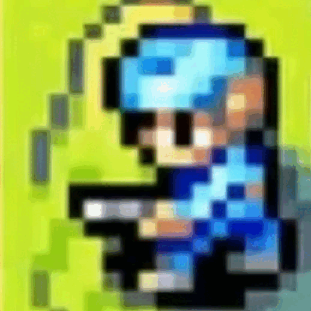
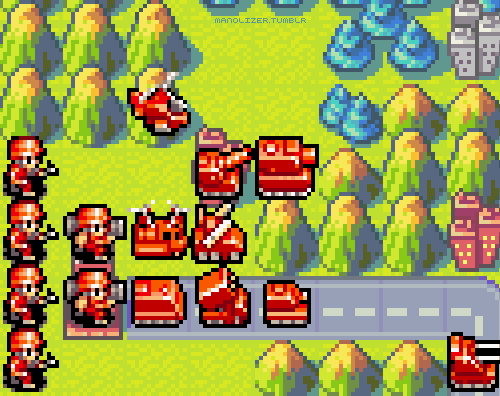
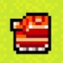
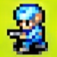
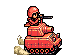
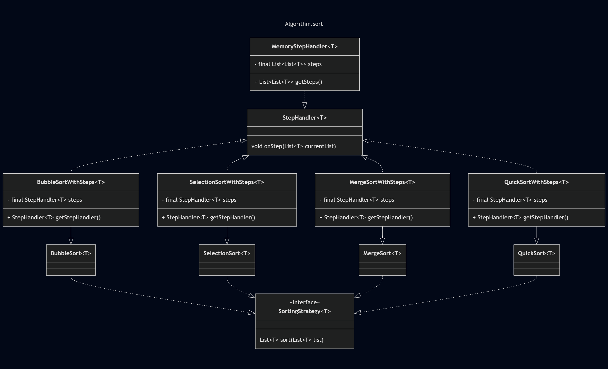
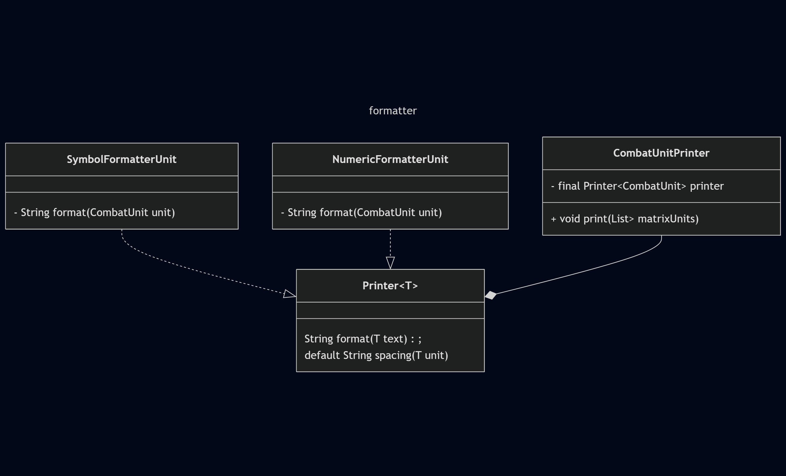

<h1>
    
    &nbsp;&nbsp;&nbsp;March of The Legion&nbsp;&nbsp;&nbsp;
    
</h1>

<table>
  <tr>
    <td width="60%" align="justify">
        The game <strong>March of the Legion</strong> is a Java-based strategy simulator that applies the principles of Object-Oriented Programming 
        to create and manage different types of military troops. On the battlefield, these units are positioned and 
        reorganized using various sorting algorithms, allowing them to be arranged according to attributes such as rank, 
        strength, or geographic position. The goal is to demonstrate, in an interactive way, how data structures and 
        sorting techniques can be applied to efficiently organize troops in a dynamic and strategic environment. The 
        game features sprites from the old Nintendo game "Advance Wars" released in 2001.
    </td>
    <td width="40%" align="center">
      
    </td>
  </tr>
</table>

<h2>
    
    &nbsp;Features
</h2>

    Many features have been implemented in this application, using images and GIFs to represent troops in a fun and 
    stylized way. The troops are withdrawn by the game Advance Wars for the Game Boy Advance, released in 2001.

<table>
  <tr>
    <td width="60%">
        <ul>
            <li><strong>Object-Oriented Programming (OOP):</strong> Designed using OOP principles for modularity and maintainability.</li>
            <li><strong>User Interface (UI):</strong> Built with JFrame to provide a graphical user interface.</li>
            <li><strong>Sorting Algorithms:</strong> Implemented four sorting algorithms: Selection Sort, Merge Sort, Bubble Sort, and Quick Sort.</li>
            <li><strong>Testing:</strong> Automated testing performed using JUnit framework.</li>
            <li><strong>Data Structures:</strong> Custom implementations of lists and interfaces.</li>
            <li><strong>Visualization:</strong> Numeric and symbolic representation of each troop displayed in the console.</li>
            <li><strong>Troop Orientation:</strong> Ability to orient troops towards north, south, east, and west directions.</li>        
        </ul>
    </td>
    <td width="40%" align="center">
      
    </td>
  </tr>
</table>

<h2>
    
    &nbsp;Troops types
</h2>

    In our game, troops will be well-organized and ranked, each with a unique character symbol and numerical value that 
    defines their role and strength.

<table align="rigth">
  <tr>
    <th>Troops</th>
    <th>Images</th>
  </tr>
  <tr>
    <td> Commander ("C", 10)</td>
    <td></td>
  </tr>
  <tr>
    <td> Doctor ("M", 20)</td>
    <td></td>
  </tr>
  <tr>
    <td> Tank ("T", 30)</td>
    <td></td>
  </tr>
  <tr>
    <td> Sniper ("S", 40)</td>
    <td></td>
  </tr>
  <tr>
    <td> Infantry ("I", 50)</td>
    <td></td>
  </tr>
</table>

<h2>
  
  &nbsp;Tools
</h2>

    The project was developed using the following technologies and tools:

<ul>
  <li>Java 23</li>
  <li>Gradle</li>
  <li>JUnit</li>
  <li>JFrame</li>
</ul>

<h2>
  
  &nbsp;How to Use
</h2>

<strong>Steps:</strong>

<ol>
  <li>
    Clone the repository: 
    <pre><code>git clone https://gitlab.com/jala-university1/cohort-5/oficial-pt-programa-o-2-cspr-124.ga.t2.25.m1/se-o-c/capstone-team-2/march-of-the-legion.git</code></pre>
  </li>
  <li>Open your preferred IDE.  </li>
  <li>
    Use the application via CLI: 
    <pre><code>java Troops a=[algorithm] t=[type] o=[orientation] u=[units] f=[size]</code></pre>
  </li>
  <li>
    To run from your system terminal, navigate to the main directory: 
    <pre><code>cd ./march-of-the-legion</code></pre>
  </li>
  <li>
    Execute the following command: 
    <pre><code>./gradlew run --args="a=[algorithm] t=[type] o=[orientation] u=[units] f=[size]"</code></pre>
  </li>
  <li>
    Example:
    <pre><code>java Troops a=b t=c o=s u=1,3,5,7,8 f=10</code></pre>
  </li>
  <li>
    Symbols:   
    <strong><code>a=</code></strong>&nbsp;Algorithm type to be used; 
    <strong><code>t=</code></strong>&nbsp;Type of troops to display; 
    <strong><code>o=</code></strong>&nbsp;Orientation of the troops; 
    <strong><code>u=</code></strong>&nbsp;Quantities of troops or <code>r=</code>&nbsp;Random quantities of troops 
    <strong><code>f=</code></strong>&nbsp;Size of the battlefield grid.  
  </li>
  <li>
    <h3>Example output on console:</h3>
  </li>

    *************** March of the Legion ***************
    Algorithm: [SelectionSort]
    Type: [Number]
    Troops: 30
    Orientation: [West]
    Battlefield: [10 x 10]

    Initial Battlefield:
    *    *    *    50   *    *    20   50   30   *
    *    30   *    *    30   30   50   *    *    *
    20   *    50   *    *    50   30   *    *    *
    *    *    *    10   *    *    *    *    *    *
    *    *    50   40   *    *    40   *    40   *
    50   *    *    *    50   *    *    *    50   *
    *    *    *    40   *    *    *    *    *    *    
    50   *    *    *    30   *    *    50   *    40
    *    50   *    *    20   *    *    *    *    *
    *    *    *    40   40   40   *    *    *    *

    Sorted Battlefield:
    10   20   20   20   30   30   30   30   30   30   
    40   40   40   40   40   40   40   40   50   50   
    50   50   50   50   50   50   50   50   50   50
    *    *    *    *    *    *    *    *    *    *    
    *    *    *    *    *    *    *    *    *    *    
    *    *    *    *    *    *    *    *    *    *    
    *    *    *    *    *    *    *    *    *    *    
    *    *    *    *    *    *    *    *    *    *    
    *    *    *    *    *    *    *    *    *    *    
    *    *    *    *    *    *    *    *    *    *    

    Ordenation Battlefield:
    *    *    *    *    *    50   *    *    *    *
    *    *    *    *    *    50   *    *    *    *
    *    *    *    *    *    50   40   *    *    *
    *    *    *    *    *    50   40   *    *    *
    *    *    *    *    *    50   40   30   *    *
    *    *    *    *    *    50   40   30   *    *
    *    *    *    *    *    50   40   30   *    *
    *    *    *    *    *    50   40   30   20   *
    *    *    *    *    50   50   40   30   20   *
    *    *    *    *    50   50   40   30   20   10
</ol>

<h2>
  
  &nbsp;Directory Architecture
</h2>

    The project’s directory structure keeps the code modular and easy to navigate, with each package serving a specific 
    purpose to ensure clarity, maintainability, and scalability

<pre>
└──main
    ├─ algorithm.sort                                               # Package to Sort Algorithms
    │   ├─ base                                                     # Package to Sort Base Algorithms
    │   ├─ extended                                                 # Package to Sort Extended Algorithms 
    │   ├─ handler                                                  # Package to sort Handlers 
    │   └──strategy                                                 # Package to Interface Sort Strategy Algorithms
    ├─ builder                                                      # Package to encapsulate some functionality
    ├─ entities                                                     # Package to business entities
    │   ├─ common                                                   # Package to generic entities
    │   ├─ map                                                      # Package to battlefield map
    │   │   ├─ exceptions
    │   │   └──generator
    │   └──units                                                    # Package to units
    │       └──behavior
    ├─ formatter                                                    # Package to show format the units 
    │   ├─ console
    │   └──unit
    ├─ game                                                         # Package to initialize game
    │   ├─ exception
    │   ├─ factory
    │   ├─ generator
    │   ├─ populators
    │   ├─ utils
    │   └──validate
    ├─ orientation                                                  # Package to orientation the troops  
    │   ├─ finder
    │   ├─ formation
    │   ├─ grid
    │   ├─ order
    │   └──strategy
    ├─ ui                                                           # Package to grafic interface for the game 
    │   └──component
    └──validation                                                   # Package to validate CLI
        └──rules
└──resources                                                        # Package to any assets on the project
    ├─ static
    │   └──gif
    ├─ diagram
    └──image
        ├─ assests
        ├─ icon
        └──troops
            └──reverse
</pre>

<h2>
  
  &nbsp;Class Diagram
</h2>

    The project follows certain rules for implementation. Below are some examples represented through class diagrams:

<h3>
    Algorithm.sort
</h3>

    This class diagram illustrates the strategy used to implement the sorting algorithm.

<h3>
    Formatter
</h3>

    This class diagram represents the component responsible for printing the troops on the console.

    If you want to explore the diagrams in more detail, follow this path: 
    <code>src/main/resources/static/diagram</code>

